# Animation

Flutter Animations.

* [Widget Animation](#widget-animation)
* [Hero Animation](#hero-animation)
* [Navigation Animation](#navigation-animation)
* [Staggered Animation](#staggered-animation)
* [Guillotine Animation](#guillotine-animation)
* [Login Animation](#login-animation)

## Widget Animation

### AnimatedList
[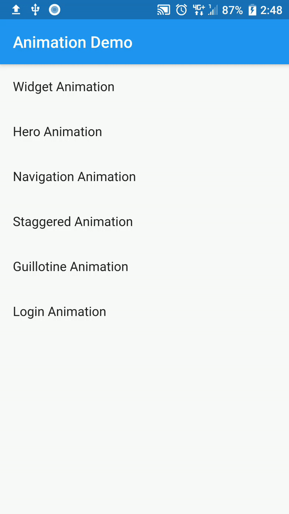](lib/widget/widget_screen.dart)

### AnimatedOpacity
[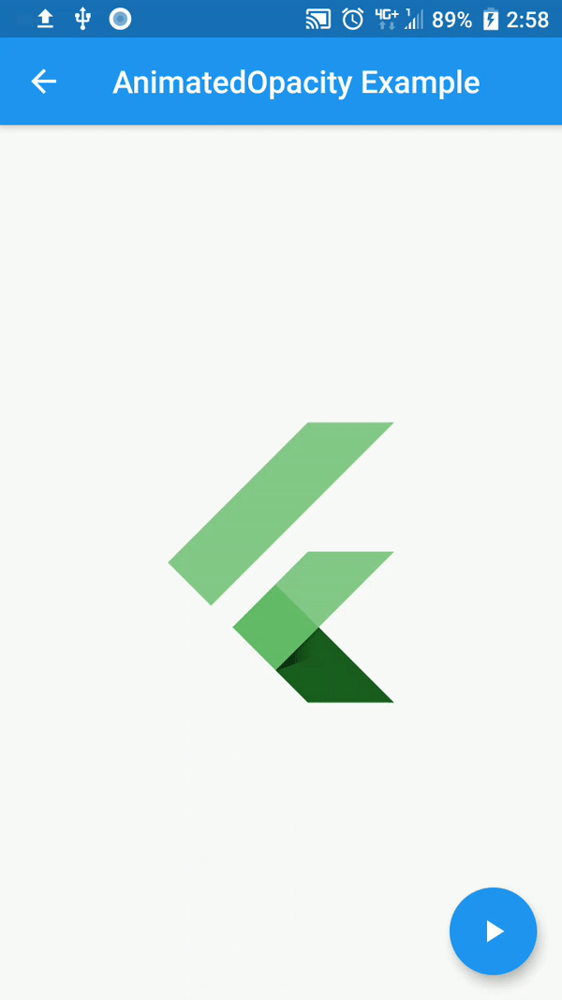](lib/widget/animated_opacity.dart)

### AnimatedDefaultTextStyle

### AnimatedCrossFade

### AnimatedContainer
[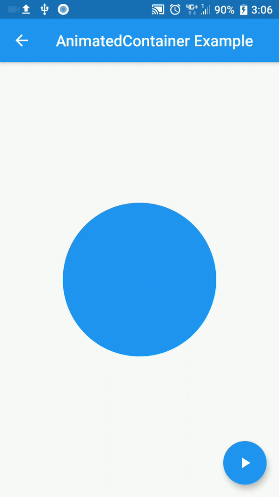](lib/widget/animated_container.dart)

### AnimatedAlign
[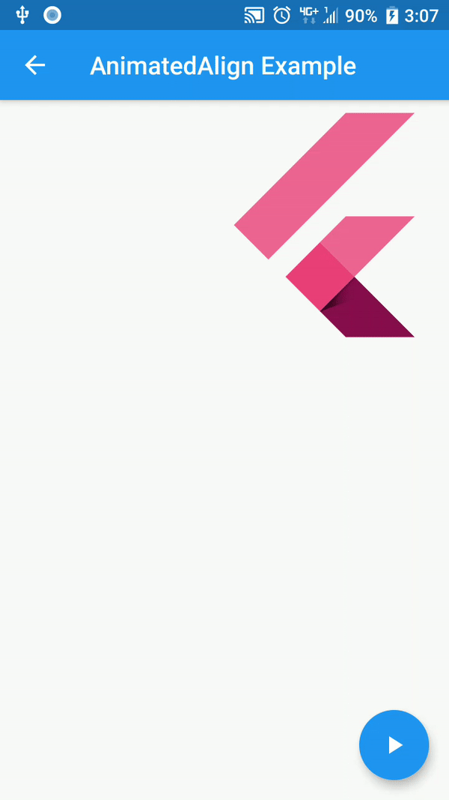](lib/widget/animated_align.dart)

### AnimatedPositioned
[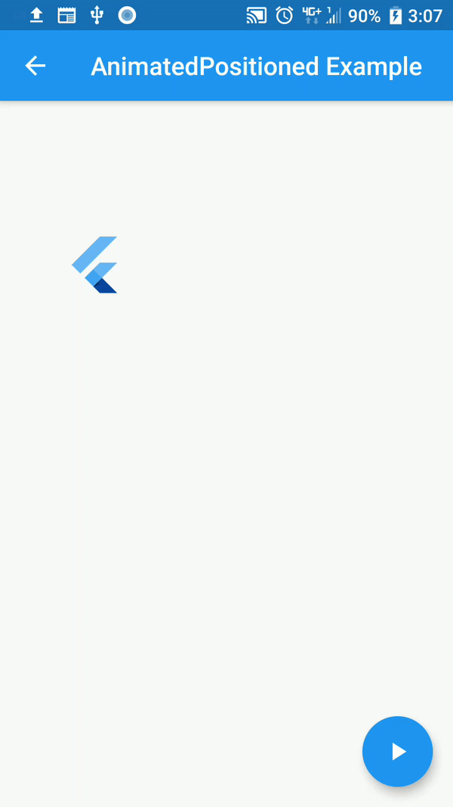](lib/widget/animated_positioned.dart)

### AnimatedPadding
[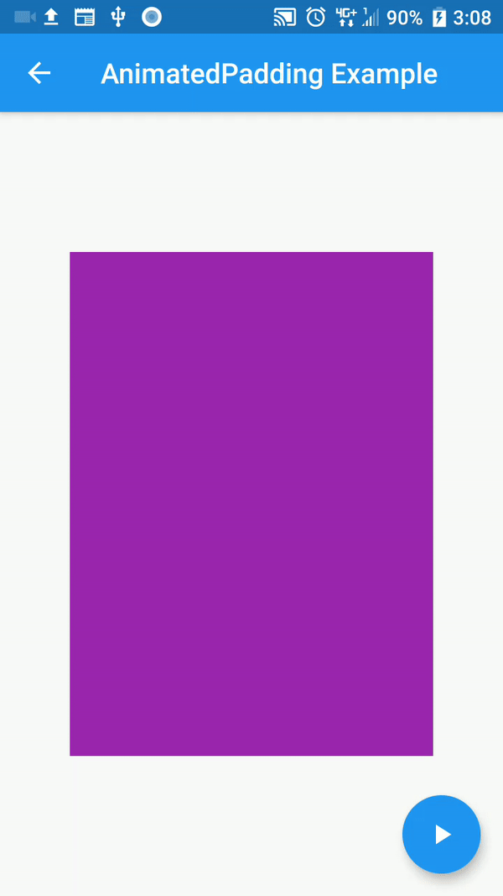](lib/widget/animated_padding.dart)

### AnimatedSwitcher
[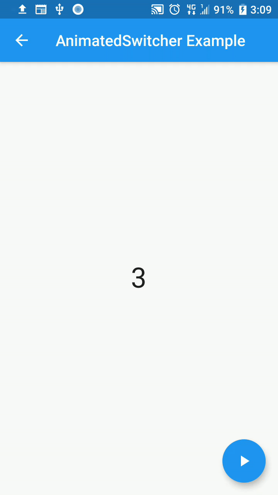](lib/widget/animated_switcher.dart)

### DecoratedBoxTransition
[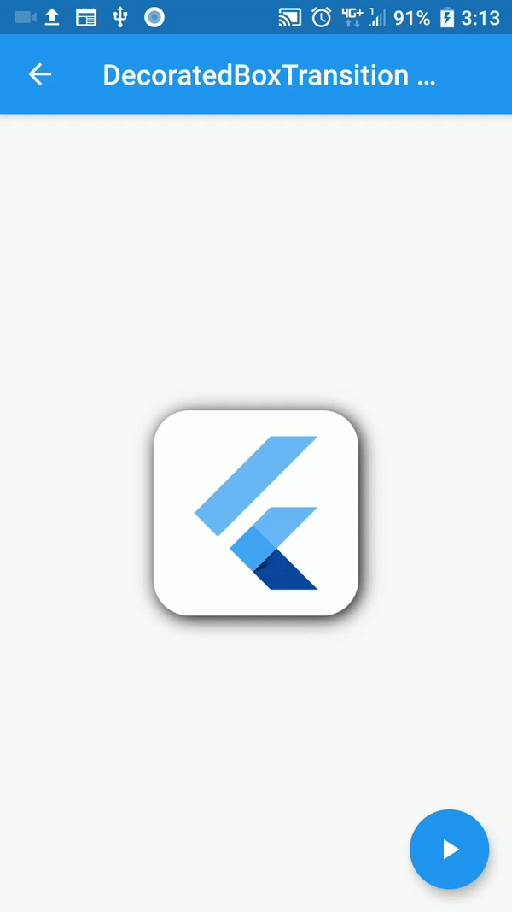](lib/widget/decorated_box_transition.dart)

### PositionedTransition
[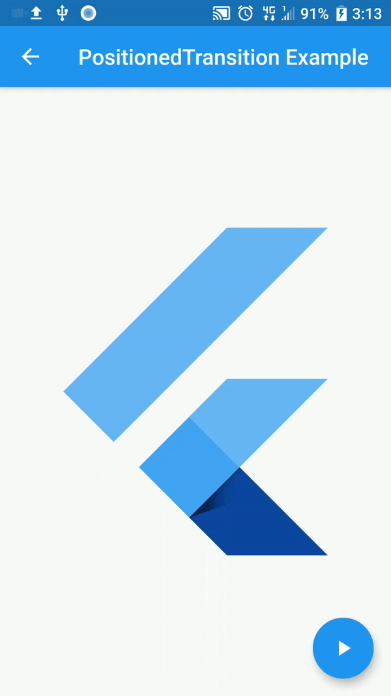](lib/widget/positioned_transition.dart)

## Hero Animation

## Navigation Animation
### Fade Navigation
[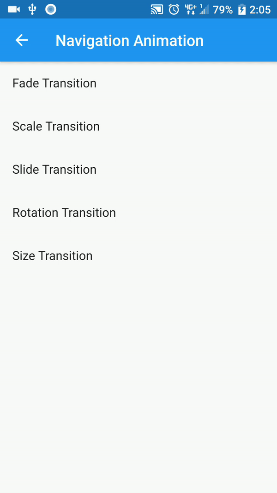](lib/navigation/navigation_screen.dart)

### Scale Navigation

### Slide Navigation
[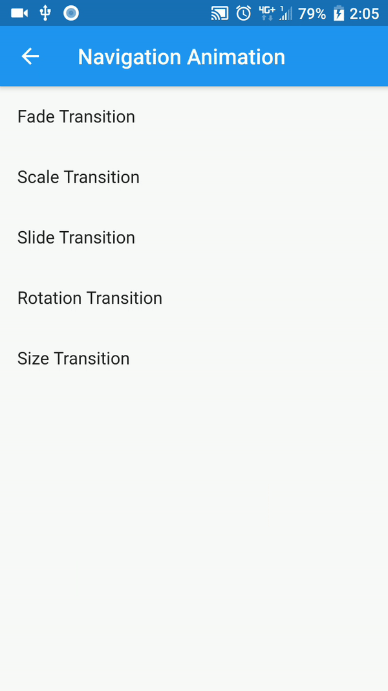](lib/navigation/navigation_screen.dart)

### Rotation Navigation
[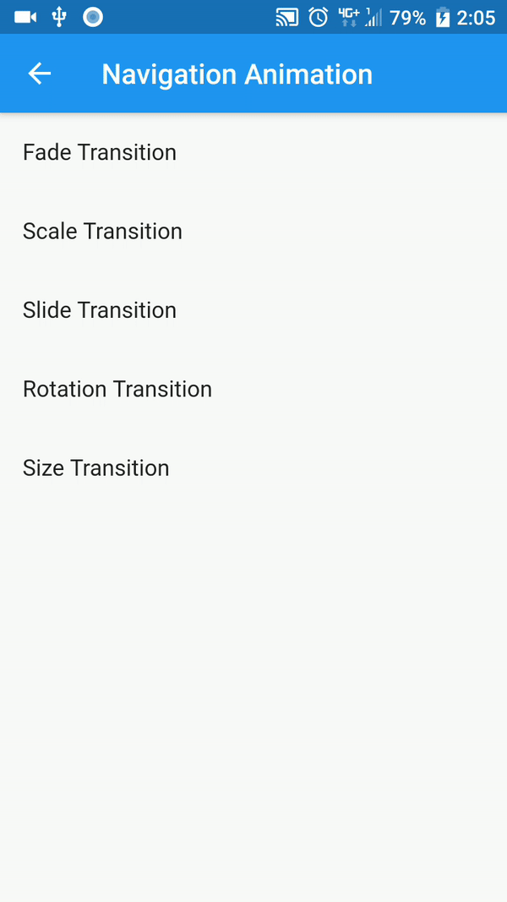](lib/navigation/navigation_screen.dart)

### Size Navigation
[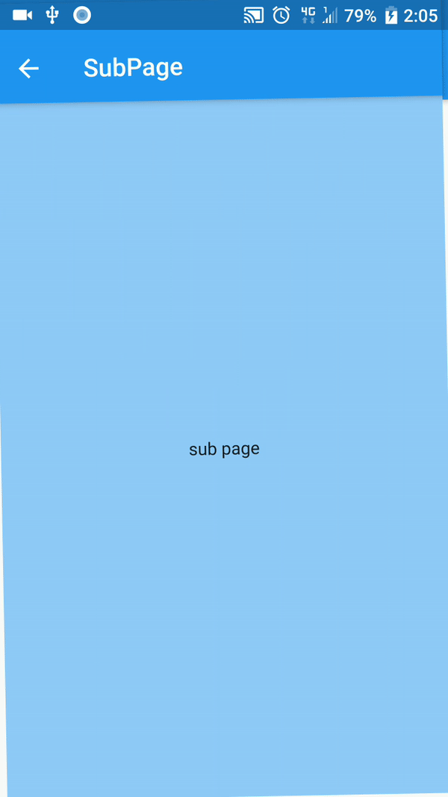](lib/navigation/navigation_screen.dart)

## Staggered Animation

## Guillotine Animation
[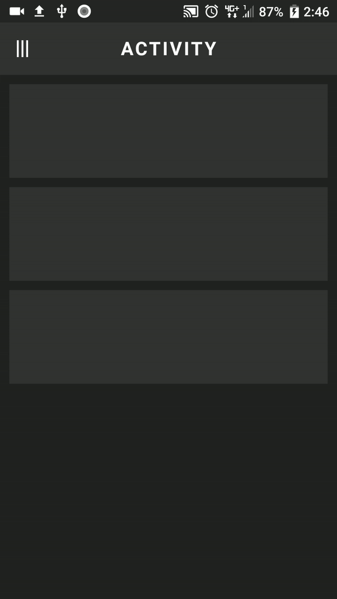](lib/guillotine_menu)

## Login Animation
[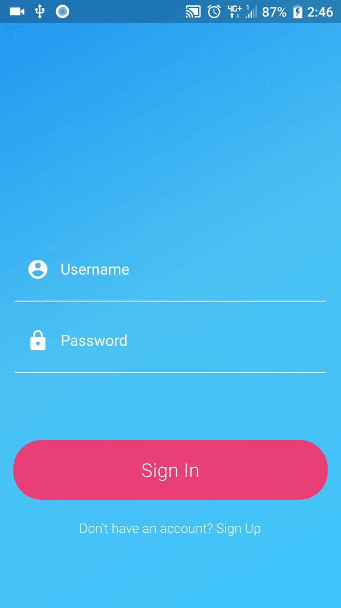](lib/login)

