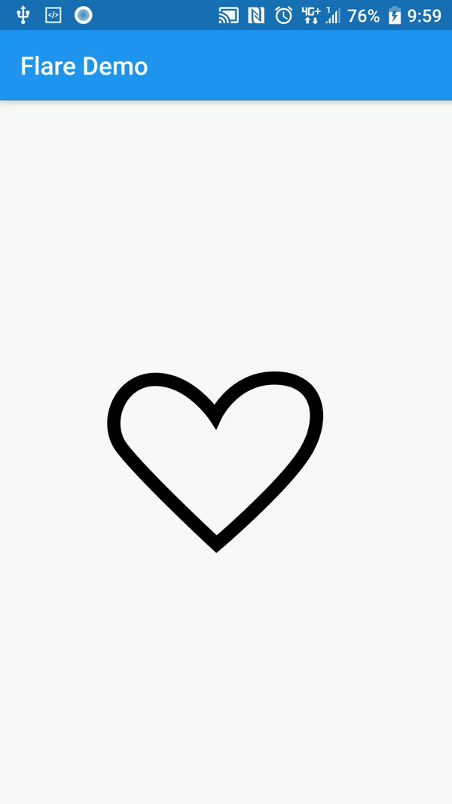

# Flare

- Github

  - https://github.com/2d-inc/Flare-Flutter

  

- Documentation

  - https://docs.2dimensions.com/support/

- Tutorials
  - [Fun with Flutter - Flare and Flutter Quick Start](https://www.youtube.com/watch?v=Q-6es0GX0fs)
  - [Fireship - Flutter Flare Basics - Let's Build Giphy's Nav Menu](https://www.youtube.com/watch?v=hwBUU9CP4qI)
  - [MTECHVIRAL - Flutter Flare 1.0 : Getting Started With 2D Animations](https://www.youtube.com/watch?v=eeXdA6gow3s)
  - [Raouf Rahiche - How to use Flare in Flutter](https://www.youtube.com/watch?v=ve0r4B1D-S0)
  - [FilledStacks - Complex Animations in Flutter using Flare](https://www.youtube.com/watch?v=vsyjMrZa5OU)
  - [Better Animations in Flutter using Flare — An Experiment](https://medium.com/flutter-community/better-animations-in-flutter-using-flare-an-experiment-bf9fa6c44f13)

- My Heart Animation learned from [Fun with Flutter](https://www.youtube.com/channel/UCU8Mj6LLoNBXqqeoOD64tFg)

  - [Flare file](https://www.2dimensions.com/a/sejkai/files/flare/myheart/preview)
  - [Code](lib/main.dart)
  - ScreenShot

  

