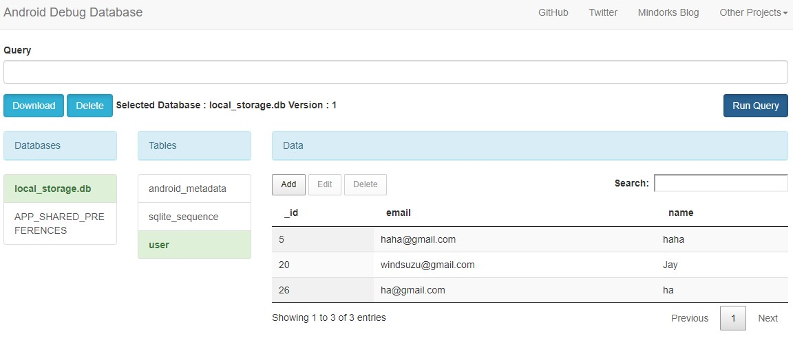

# Local Storage

利用 Shared Preferences 和 Sqflite 第三方庫，將 data 記錄在本地端。

並且利用 Android 好用的 Android Debug Database 來即時查看 local storage 的數據狀態。


## Getting Started

* [Android Debug Database](#android-debug-database)

* [Shared Preferences](#shared-preferences)
* [Sqflite](#sqflite)


## Android Debug Database

* Github: https://github.com/amitshekhariitbhu/Android-Debug-Database


Add this to your app's [build.gradle](android/app/build.gradle):  `android/app/build.gradle`

  ```gradle
  debugImplementation 'com.amitshekhar.android:debug-db:1.0.6'
  ```

> debugImplementation 只會在 debug 模式下才會引入。


接著將 debug 的手機及電腦連接至相同網路中 (wifi / LAN)，並且在 App 執行之後鎖定 Logcat，並找到

```
D/DebugDB: Open http://XXX.XXX.X.XXX:8080 in your browser
```

即可連結到 Android debug database 的頁面使用。

>內建 emulator 要到 terminal 跑 `adb forward tcp:8080 tcp:8080`然後 open [http://localhost:8080](http://localhost:8080/)
>
>Genymotion 則到 virtualbox 打開 Bridged adapter 即可使用 ! [教學在這裡](https://www.youtube.com/watch?v=dkP4WFFEYp8)。


完成後，可以查詢頁面並且輕鬆修改、刪除




## Shared Preferences

* Pub: https://pub.dev/packages/shared_preferences


My example for keeping counter value

* [SharedPreferences Model](lib/shared_preferences/counter_preferences.dart)
* [UI layer](lib/shared_preferences/preferences_screen.dart)


## Sqflite

* Pub: https://pub.dev/packages/sqflite
* Other useful tutorial: https://medium.com/flutter-community/using-sqlite-in-flutter-187c1a82e8b


My example for keeping user data in SQLite

* [Sqflite provider](lib/sqflite/sqflite_provider.dart)
* [User provider model](lib/sqflite/user_provider.dart)
* [User model](lib/sqflite/user.dart)
* [UI layer](lib/sqflite/sqflite_screen.dart)